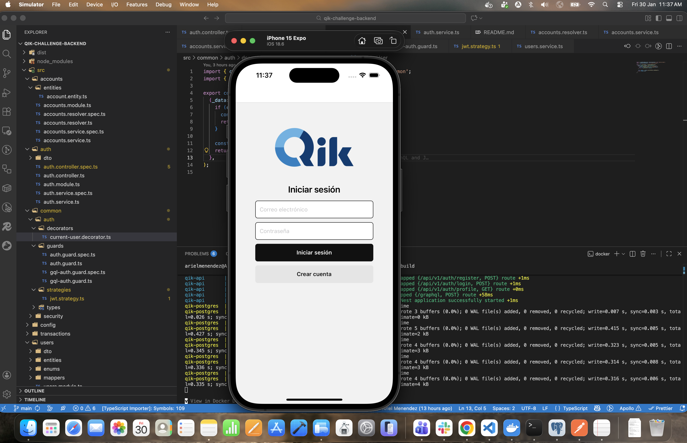
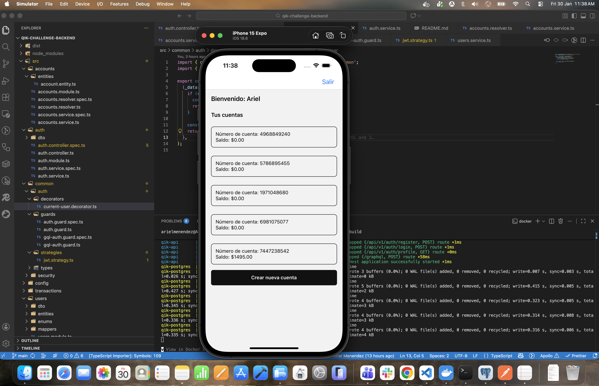
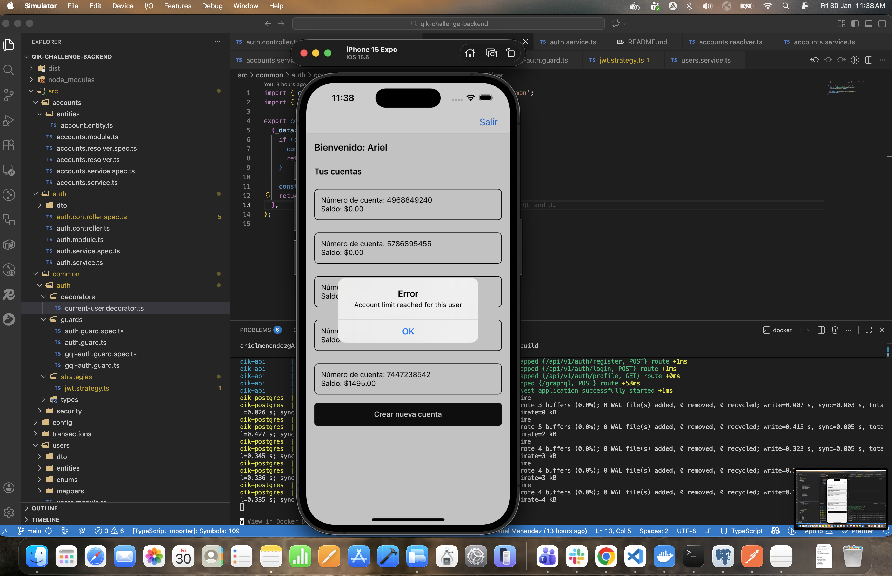
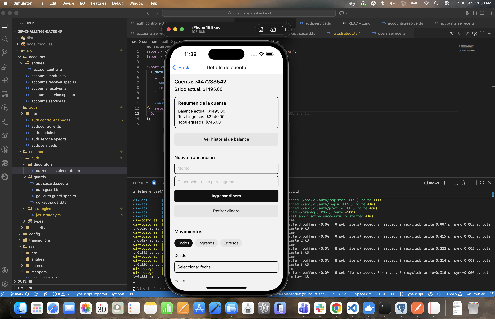
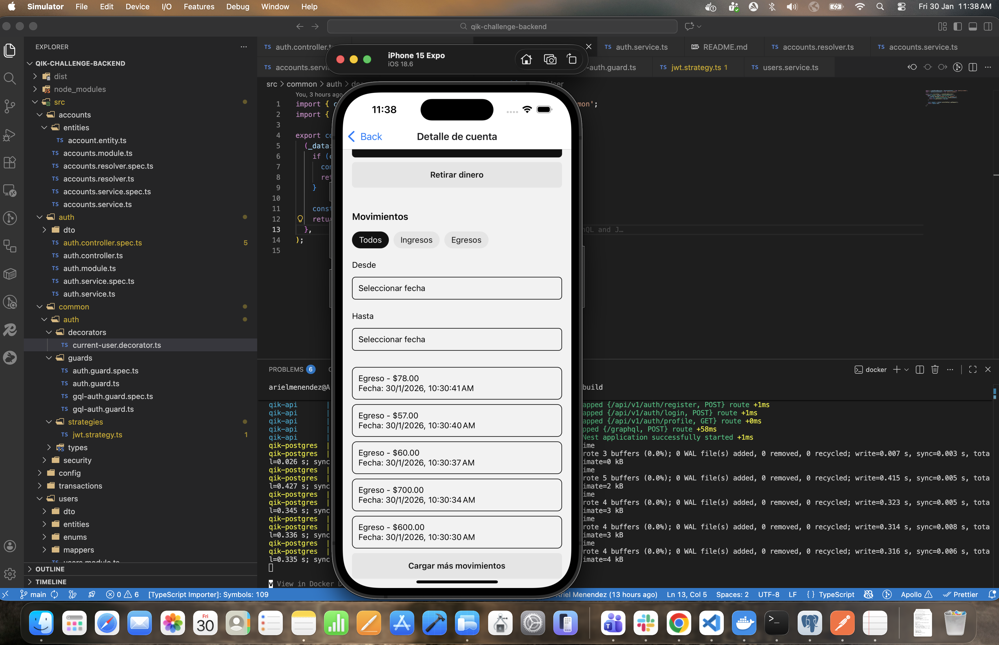

# Frontend — Qik Accounts & Ledger App

Aplicación móvil desarrollada con React Native y Expo como parte de la Prueba Técnica Full-Stack.

Esta app permite a los usuarios:

- Ver sus cuentas bancarias  
- Consultar balance  
- Registrar transacciones (ingresos y egresos)  
- Filtrar y paginar movimientos  
- Ver resúmenes financieros  

Se integra con el backend Accounts & Ledger Service.

---

## Autenticación

La autenticación se maneja mediante endpoints REST del backend:

- Registro de usuario  
- Login  
- Perfil del usuario autenticado  

Estos endpoints devuelven un JWT, que luego es utilizado para autorizar las solicitudes GraphQL.

**Login / Register / Profile → REST**  
**Cuentas, balances, transacciones, resúmenes → GraphQL**

---

## Stack

- **React Native (Expo)**
- **TypeScript**
- **Apollo Client (GraphQL)**
- **React Navigation**
- **Jest + React Native Testing Library**

---

## Requisito Importante

**El backend debe estar ejecutándose antes de iniciar esta app.**

Este frontend consume la API REST y GraphQL del backend.  
Sin el backend activo, la app no podrá autenticarse ni obtener datos.

Consulta el README del backend para levantarlo con Docker.

---

## Instalación

Desde la raíz del proyecto frontend:

```bash
npm install
```

---

## Ejecutar la app

```bash
npx expo start
```

Luego puedes abrir la app en:

- Expo Go (Android/iOS)
- Emulador Android
- Emulador iOS

---

## Configuración de API

La app se conecta al backend vía REST y GraphQL.

Si el backend corre localmente con Docker, normalmente estará en:

```
http://localhost:3000
```

GraphQL:

```
http://localhost:3000/graphql
```

Ajusta las URLs en la configuración de API si es necesario.

---

## Screenshots de la App








---

## Testing

El proyecto incluye pruebas automatizadas usando:

- **Jest**
- **React Native Testing Library**

### Ejecutar tests

```bash
npm test
```

### Cobertura de pruebas

```bash
npm test -- --coverage
```

### ¿Qué se está testeando?

- Componentes reutilizables (botones, inputs)  
- Componentes de dominio (listas de transacciones, formularios)  
- Pantallas completas con hooks mockeados  
- Hooks con lógica de negocio (paginación, estados derivados)  

El enfoque de testing prioriza:

- Lógica de negocio  
- Interacciones del usuario  
- Integración entre componentes  
- Estados de carga y error  

---

## Estructura del Proyecto

```
app/
 ├── components/
 │    ├── account/
 │    └── UI compartidos
 ├── screens/
 ├── hooks/
 ├── graphql/
 ├── navigation/
 └── __tests__/
```

La arquitectura está organizada de forma modular, separando:

- UI  
- Lógica (hooks)  
- Comunicación con API  
- Navegación  

---

## Funcionalidades Implementadas

### Cuentas
- Ver balance actual  
- Ver resumen de créditos y débitos  
- Ver historial de balance  

### Transacciones
- Registrar ingreso (crédito)  
- Registrar egreso (débito)  
- Validación de montos  
- Actualización automática de balance  

### Historial de Movimientos
- Listado de transacciones  
- Filtros por tipo (CREDIT / DEBIT)  
- Filtros por rango de fechas  
- Paginación con "Cargar más"  

---

## Buenas Prácticas Aplicadas

- Arquitectura modular y separada por responsabilidades  
- Tipado fuerte con TypeScript  
- Hooks personalizados para lógica de negocio  
- Componentes reutilizables  
- Manejo de estados de carga y error  
- Testing enfocado en comportamiento y lógica crítica  

---

**Proyecto desarrollado como parte de la Prueba Técnica Full‑Stack para Qik Banco Digital por Ariel Menéndez Méndez.**
